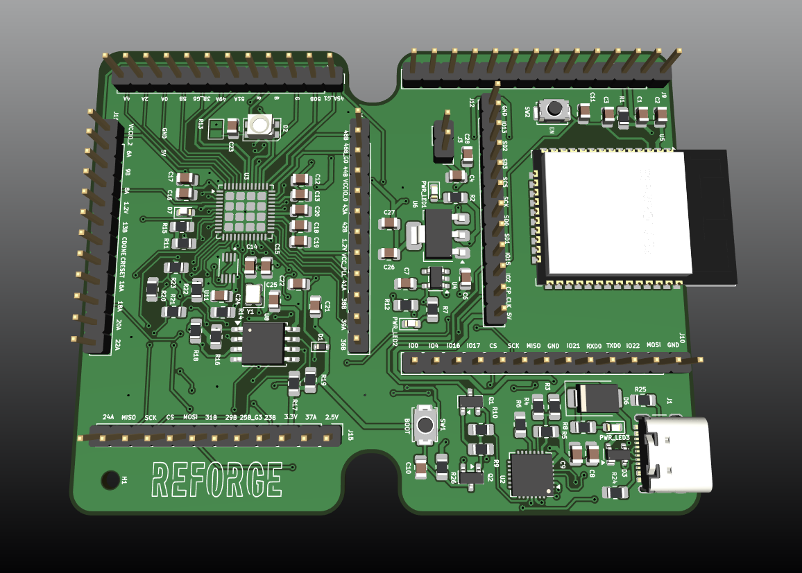
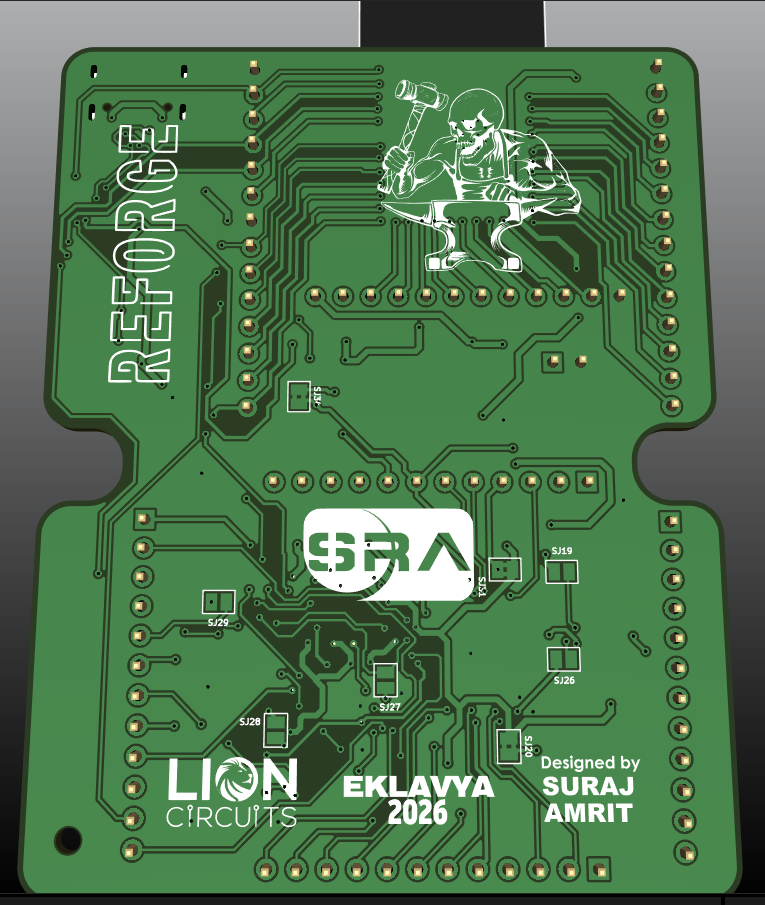

<div align="center">

# Reforge

**Custom FPGA Development Board & ESP32 Host System**




## **FRONT**



## **BACK**

</div>

## Table of Contents
* [About the Project](#about-the-project)
  * [Aim](#aim)
  * [Description](#description)
  * [Tech-Stack](#tech-stack)
* [File Structure](#file-structure)
* [Getting Started](#getting-started)
* [Usage](#usage)
  * [1. iCE40 FPGA Graphics Demo](#1-ice40-fpga-graphics-demo)
  * [2. ESP32 Host Firmware](#2-esp32-host-firmware)

---

## About the Project

### Aim
Designing a custom PCB development board that combines an ESP32 microcontroller and an iCE40 FPGA to understand how microcontrollers and FPGAs interact in real embedded systems.

### Description
Instead of relying on fixed hardware, FPGAs allow for custom hardware configurations. In this project, the **ESP32** acts as the host system. It is responsible for storing FPGA designs in its filesystem and loading them directly onto the **iCE40 FPGA** when needed. The two chips communicate via SPI, allowing the ESP32 to send data and control the FPGA dynamically. 

The current hardware prototype includes a custom VGA output implementation, where the FPGA acts as a hardwired video card rendering horizontal RGB color bands in real-time.

### Tech-Stack
* **Languages:** Embedded C (ESP32), Verilog HDL (FPGA)
* **Tools:** ESP-IDF, OSS CAD Suite (Yosys, NextPNR), KiCAD
* **Protocols:** SPI (Inter-chip communication), VGA (Analog Video),OTA 

---

## File Structure

```text
Reforge
├── ESP32E                  # ESP32 source code and firmware
│   └── OTA                 # Host system and file management
│       ├── main            # Core C files (SPI communication, FPGA config)
│       ├── CMakeLists.txt  # Build configuration
│       └── partitions.csv  # Custom memory partitions for bitstream storage
        └── README.md  
├── ICE40                   # FPGA hardware designs in Verilog
│   ├── blink               # Basic LED blink and SPI test
        ├── blink.v           # Verilog logic for horizontal RGB bands
│       ├── pins.pcf        # FPGA pinout mapping
│       ├── build.bat       # Automated synthesis script
│       └── flash.bat       # Automated flashing script
│   └── VGA                 # Custom hardware VGA generator
│       ├── vga.v           # Verilog logic for horizontal RGB bands
│       ├── pins.pcf        # FPGA pinout mapping
│       ├── build.bat       # Automated synthesis script
│       └── flash.bat       # Automated flashing script
├── KICAD                   # Schematics for the custom development board
│   ├── Reforge.kicad_sch
│   └── Reforge.kicad_pcb
└── README.md
```
## Getting Started

### Installation

Clone the repository:

```bash
git clone https://github.com/kishorju-vrind/Reforge.git
cd Reforge
```

## System Architecture & Modules

The project is divided into different functional modules. Each module handles a specific part of the system.

- **FPGA Configuration Manager:** Stores multiple FPGA designs on the ESP32 and loads them onto the iCE40 FPGA.
- **ESP32-iCE40 SPI Communication:** Handles data transfer and control between the ESP32 and iCE40 FPGA using SPI.
- **Over-The-Air (OTA) Updates:** Allows new bitstreams and firmware to be downloaded remotely over Wi-Fi.
- **Bitstream Transfer & CRC Check:** Transfers the FPGA configuration file in parts and checks the data for errors during transfer.
- **Wireless Design Selection:** Allows the user to select and load the required FPGA design remotely.

## Usage

The following steps explain how to build and run the different parts of the project.

### 1. OTA

Go to the OTA directory:

```bash
cd ESP32/OTA
```

Enter your Wi-Fi SSID and password in the required fields in the code:

```
#define WIFI_SSID "Your_SSID"
#define WIFI_PASS "Your_Password"
```
Build the project using ESP-IDF:
```
idf.py fullclean
idf.py build
```

Flash the firmware and open the serial monitor:
```
idf.py flash monitor
```

### 2.FPGA Configuration

## Results
The schematic for the custom PCB was completed. The main communication and FPGA related functions were also tested separately.

The following results were achieved:

- ESP32-E to ESP32-E communication
- OTA communication and wireless FPGA configuration
- VGA output using the iCE40 (UPduino) FPGA

## Contributions

## Mentors

## Documentation

## Acknowledgement

