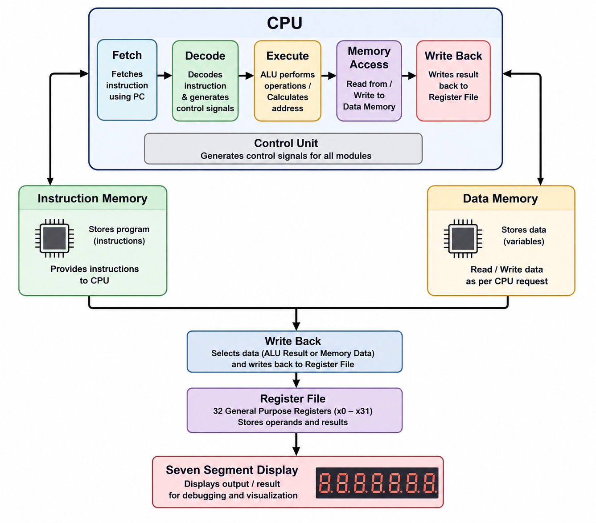
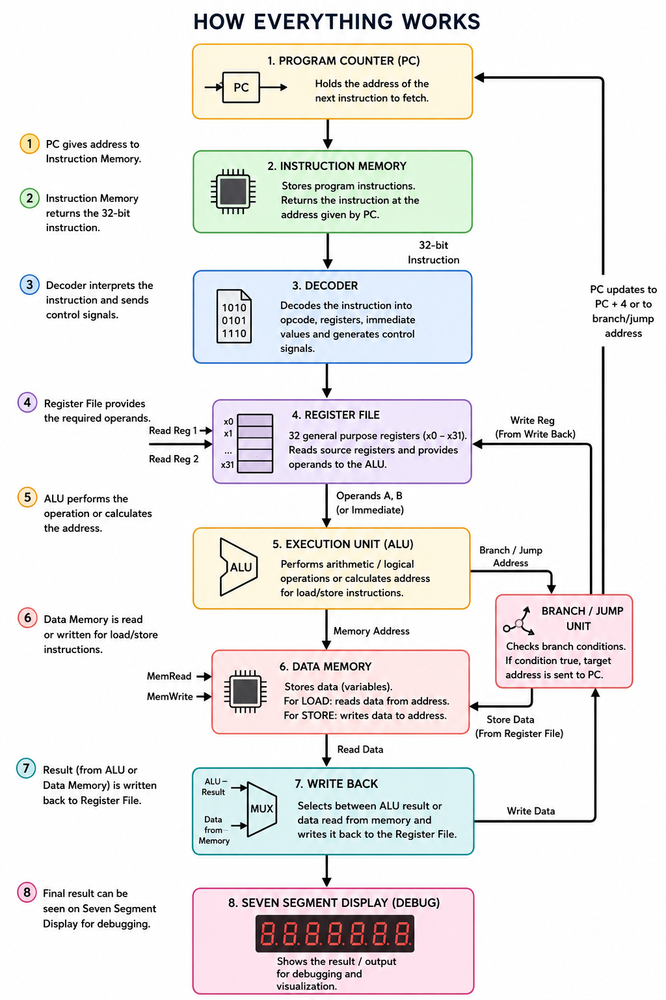

# Synapse-32

Synapse-32 is a 32-bit RISC-V CPU core written in Verilog, supporting RV32I instructions, along with Zicsr and Zifencei extensions.

## What is RISC-V
  RISC-V [Reduced Instruction Set Computer(pronounced "risk five")] is an open-source Instruction Set Architecture (ISA). It defines what instructions a CPU understands, but not how the CPU is built.
  The idea is:
  - Use fewer, simpler instructions
  - Execute them quickly
  - Let software combine simple instructions to perform complex tasks

    

## Processor Architecture

### 5-Stage Pipeline
This processor implements a classic 5-stage RISC pipeline:

1. **IF (Instruction Fetch)**: 
   - Fetches the next instruction from instruction memory
   - Updates the Program Counter (PC)

2. **ID (Instruction Decode)**:
   - Decodes the instruction
   - Reads values from register file
   - Generates immediate values and control signals

3. **EX (Execute)**:
   - Performs ALU operations
   - Calculates branch/jump addresses
   - Makes branch decisions

4. **MEM (Memory Access)**:
   - Performs memory reads and writes
   - Handles load and store instructions

5. **WB (Write Back)**:
   - Writes results back to the register file
   - Selects appropriate data source (ALU or memory)

### Pipeline Hazards
#### A **pipeline hazard** is a situation where the CPU cannot execute the next instruction as planned, causing a **stall** or **delay** in the pipeline.
There are **three types of pipeline hazards**.
---
#### 1. Structural Hazard
A **structural hazard** occurs when **two instructions need the same hardware resource at the same time**.
*Example*
Instruction 1 → MEM (uses memory)
Instruction 2 → IF  (fetches instruction)

Both require the same memory.
Since only one memory is available, one instruction must wait.
**Solution:** Use separate instruction and data memory or duplicate the hardware.

---

#### 2. Data Hazard

#### A **data hazard** occurs when an instruction depends on the result of a previous instruction that has not finished executing.
*Example*
assembly
ADD x3, x1, x2
SUB x4, x3, x5

SUB needs the updated value of `x3`, but `ADD` has not written it back yet.
**Solution:** Use **Forwarding (Bypassing)** or **stall the pipeline** until the data is available. 
---
#### 3. Control Hazard

A **control hazard** occurs when the CPU does not know which instruction to execute next because of a **branch** or **jump** instruction.

*Example*

assembly
BEQ x1, x2, LOOP
ADD x3, x4, x5
If `x1 == x2`, the CPU jumps to `LOOP`, so the `ADD` instruction should not execute. However, the CPU may have already fetched it before knowing the branch result.

**Solution:** Use **pipeline flush**, **branch prediction**, or **stall** until the branch decision is known.

---

5 STAGE PIPELINE IN WORK


#### Summary

| Hazard | Cause | Example | Solution |
|---------|-------|---------|----------|
| **Structural** | Same hardware needed by multiple instructions | IF and MEM using the same memory | Separate hardware or stall |
| **Data** | Instruction depends on previous result | `ADD` → `SUB` | Forwarding or stall |
| **Control** | Branch or jump changes program flow | `BEQ`, `JAL` | Branch prediction, flush, or stall |

> **Key Idea:** Pipeline hazards prevent smooth instruction execution. Modern processors reduce their impact using forwarding, branch prediction, pipeline flushing, and better hardware design.

------
------
# PROJECT OVERVIEW
This project was created in order to create a RISC-V CPU ona an Upduino 3.0 FPGA using verilog HDL.
My AIM is to learn the concepts of RISC-V and how it works, apart form that i aim to get a decent grasp of comp-arch and try to understand this project.

THIS PROJECT BELONGS TO SRA-VJTI and here it is just being used to study and research purpose, theres no misuse of data and no plagarism intended.

## Workflow
This is a *2 STAGE PROCESSOR*.

FIRST STAGE:
- Instructions are fed and decoded
- Values are read from register file
- Sending necessary parameters to ALU if needed
- Writing in DMem and sending read signals
- Send jump to PC

SECOND STAGE:
- Get ALU output
- Read data from Dmem
- Control unit writes to register file
- PC executes jump instruction
- Show output on *SEVEN SEGMENT DISPLAY*


----

## COMPONENTS OF CPU

Following are the components of RISC-V CPU :


1. ### PROGRAM COUNTER
   Think of it as: The CPU's bookmark.
   The Program Counter stores the address of the next instruction that needs to be executed.
   Example:
   0x0000  ADD
   0x0004  SUB
   0x0008  LW
   Initially
   ```
   PC = 0x0000
   ```
   After one Instruction
   ```
   PC = 0x0004
   ```
   After another
   ```
   PC = 0x0008
   ```
   If a jump or branch occurs, instead of adding 4, the PC jumps to another address.
   Without the PC, the CPU would never know which instruction comes next.

2. ### INSTRUCTION MEMORY
    Think of it as: The CPU's library.
    This module stores the machine code program.
    In this repo
    ```
    instr_mem.v
    ```
    contains an array
    ```verilog
    reg [31:0] instr_ram [0:MEM_SIZE-1];
    ```
    Each location stores one 32-bit RISC-V instruction.
    When the PC sends an address,

    PC

    ↓

    INSTRUCTION MEMORY

    ↓

    32-bit INSTRUCTION
  
    the memory simply returns that instruction.
    It only stores the program—it never performs calculations.
  
3. ### DECODER (Instruction Decoder)
    Think of it as: A translator.
    The CPU receives a 32-bit binary number like
    ```
    00000000010100010000001010110011
    ```
    Humans cannot understand this directly.
    The decoder breaks it into fields:
    ```
    opcode
    rd
    rs1
    rs2
    immediate
    instruction type
    ```
    For example
    ```
    ADD x5,x1,x2
    ```
    becomes 
    ```
    Operation = ADD
    Read register x1
    Read register x2
    Store result in x5
    ```
    The decoder tells every other hardware block what needs to happen.
4. ### REGISTER FILE
    Think of it as: The CPU's working table.
    Registers are tiny pieces of extremely fast memory inside the CPU.
    RISC-V has
    ```32 registers```
    named
    ```
    x0
    x1 
    ...
    x31
    ```
    Instead of going to RAM every time,
    the CPU first checks these registers.
    Example
    ```
    x1 = 20
    x2 = 30
    ```
    For
    ```
    ADD x3,x1,x2
    ```
    the register file supplies
    ```
    20
    30
    ```
    to the ALU.
    Later,
    the answer
    ```50```
    is written back into x3.
5. ### IMMEDIATE GENERATOR
    Many instructions contain numbers directly inside them.
   Example
   ```
   ADDI x1,x2,5
   ```
   The number
   ```
   5
   ```
   is not stored in any register.
   It is extracted from the instruction.
   Your decoder generates this value as
   ```
   imm
   ```
   which is sent to the execution unit.
6. ### EXECUTION UNIT
    This is the brain of the CPU.
   File:
   ``` execution_unit.v ```
   It performs all calculations.
   Examples
   ```
   5 + 7
   20 - 3
   A AND B
   A OR B
   Shift Left
   Compare numbers
   ```
   It also
   - calculates memory addresses
     
     ```
     LW x1,8(x2)
     ```
     
     Address
     
     ```
     x2 + 8
     ```
     
     is calculated here.
     
   It also
     
   - decides branch conditions
     
     Example
     
     ```
     BEQ
     ```
     
     Checks
     
     ```
     Are rs1 and rs2 equal?
     ```
     
     If yes
     
     ```
     Jump
     ```
     
     Otherwise
     ```
     Continue normally
     ```
     
7. ### ALU
    Inside the execution unit is the ALU.

    The ALU is the calculator of the processor.

    It performs operations like

    ```
    Addition

    Subtraction

    Multiplication (if supported)

    AND

    OR

    XOR

    Shift

    Comparison
    ```

    It does not store data.

    It only produces results.
   
8. ### MEMORY UNIT
    File

    ```
    memory_unit.v
    ```

    This block decides

    Should we read memory?
    
    or
    
    Should we write memory?

    Example
    For
    ```
    LW
    ```
    it produces

    ```
    Read Enable = 1
    Write Enable = 0
    ```
    For
    ```
    SW
    ```
    it produces
    ```
    Read Enable = 0
    Write Enable = 1
    ```
    It also generates
    ```
    Address
    Write Data
    Byte Enable
    ```
    so that the data memory knows exactly what to do.
9. ### DATA MEMORY
    File
    ```
    data_mem.v
    ```
    Instruction memory stores the program.
    
    Data memory stores variables.
    
    Example
    ```
    int age = 19;
    ```
    is stored here.
    The CPU can
    ```
    Read
    Write
    Update
    ```
    this memory.
    Example
    ```
    LW
    ```
    copies
    ```
    Memory
    ↓
    Register
    ```
    Example
    ```
    SW
    ```
    copies
    ```
    Register
    ↓
    Memory
    
10. ### WRITE BACK UNIT
    File

    ```
    writeback.v
    ```
    After computation,

    where should the result go?

    This module answers that.

    Example

    For

    ```
    ADD
    ```
    the ALU result

    ```
    40
    ```
    
    is written into a register.

    For

    ```
    LW
    ```
    the value coming from memory

    ```
    100
    ```
    is written into the register instead.

    Your code literally does this:

    ```
    If Load Instruction

    ↓

    Write Memory Data

    Else

    ↓

    Write ALU Result
    ```
    This is the last stage of an instruction.
11. ### PIPELINE REGISTERS
    Your CPU is pipelined.

    That means several instructions execute simultaneously.
    Pipeline registers separate stages.

    For example

    ```
    IF/ID
    ID/EX
    EX/MEM
    MEM/WB
    ```
    They temporarily store:
    - instruction
    - operands
    - control signals
    between stages.

    They are like conveyor belts in a factory.
    
12. ### HAZARD DETECTION
    Sometimes one instruction needs the result of another instruction that hasn't finished yet.
    Example
    ```
    ADD x1,x2,x3
    SUB x4,x1,x5
    ```
    The second instruction needs
    ```
    x1
    ```
    before the first instruction has written it.
    Your CPU contains
    ```
    load_use_detector
    ```
    which detects this problem.
    It either
    - stalls the pipeline
    or
    - waits one clock cycle
    to avoid incorrect results.

13. ### FORWARDING UNIT
    Instead of waiting,
    sometimes the CPU forwards the result directly.
    Example
    ```
    ALU Result
    ↓
    Forward
    ↓
    Next ALU
    ```
    without waiting for register write-back.
    Your execution unit includes signals like
    ```
    forward_a
    forward_b
    ```
    to support this optimization.
    
14. ### CONTROL UNIT
    The control unit is the manager of the CPU.
    It tells every component what to do.
    Examples
    ```
    Use ALU
    Read Memory
    Write Memory
    Jump
    Branch
    Write Register
    ```
    Without the control unit,
    all hardware would exist,
    but nothing would know when to operate.
    
15. ### SEVEN SEGMENT DISPLAY
    File
    ```
    seven_seg.v
    ```
    This module converts binary numbers into patterns that light up a seven-segment display.
    Example
    ```
    Binary
    1010
    ```
    becomes
    ```
    A
    ```
    The display module converts each 4-bit hexadecimal digit (nibble) into the corresponding seven segment pattern, allowing a full 32-bit value to be shown across eight displays. It's mainly used for debugging and visualizing CPU outputs on hardware.
    
16. ### TOP MODULE
    File
    ```
    top.v
    ```

    The top module is the motherboard of your processor.

    It connects everything together:
    

    It instantiates

    CPU
    * Instruction Memory
    * Data Memory
    * Timer
    * UART
    * Memory mapping
    * Interrupt handling

    and connects them with wires so the whole processor works as one system.

---
# How Everything Works Together
  


   
   
  


